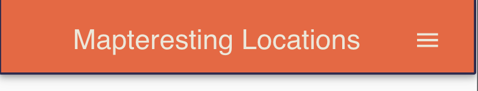
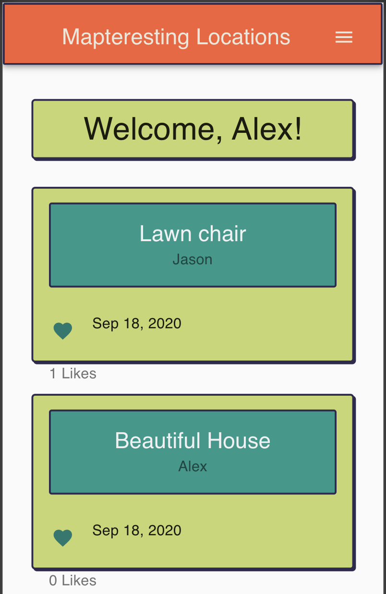
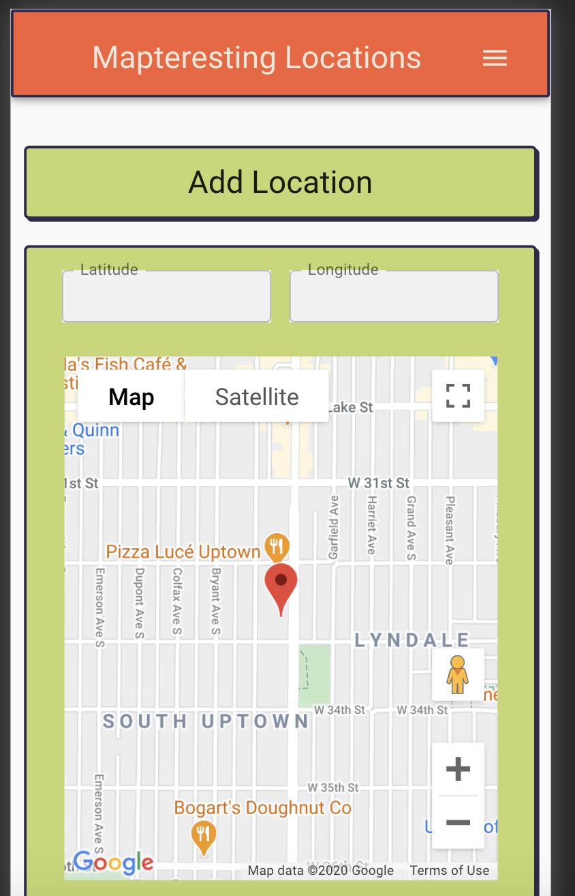
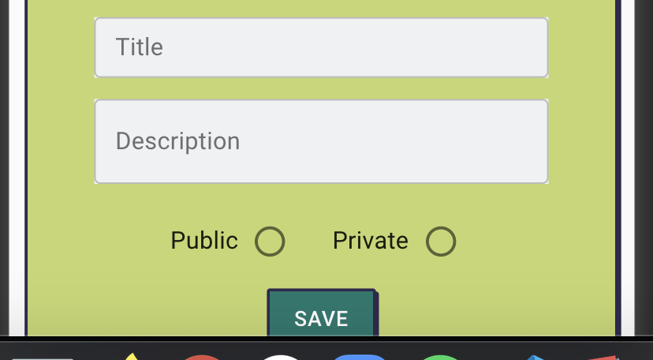
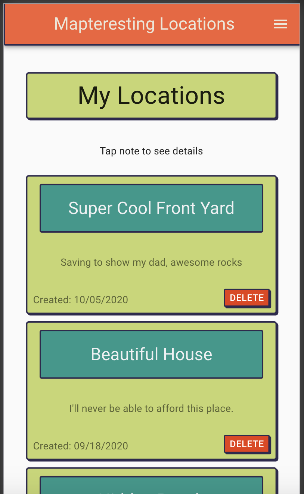
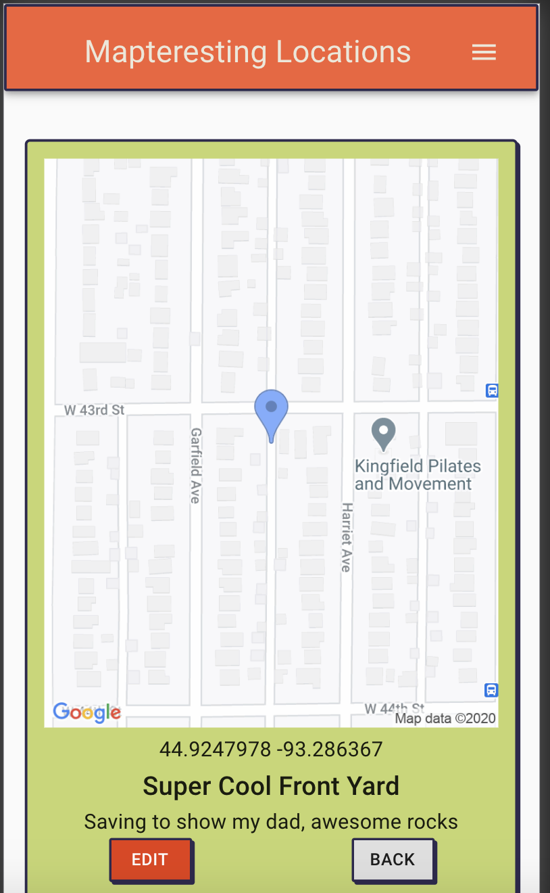
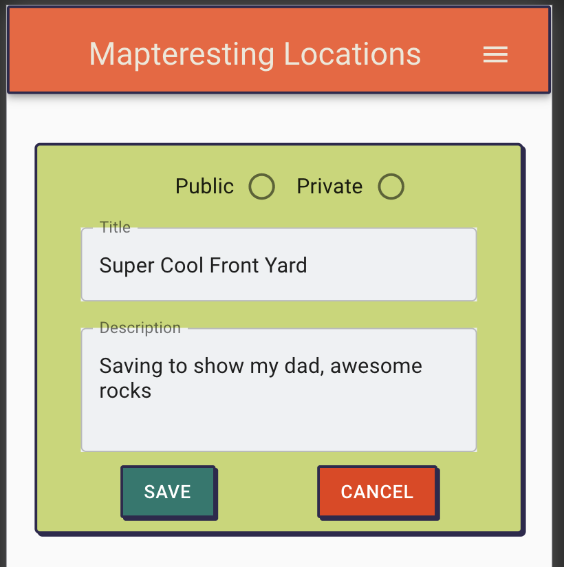

# Mapteresting Locations

## Description
I created this App so I could have something that would let me save a spot on a map to remember and maybe show off to others.  The big challenge was getting the google maps to give me the location I was looking for.  The extra feature I was trying to get updated was to get the like button to work.

## ON START UP

1. After cloning and starting up this app run:
```
npm install
```

2. Once everything is installed create a database called mapteresting_notes and then copy the ```CREATE TABLE``` code from the database.sql file

3. Before running the server create a ```.env``` file.  In .env add ```SERVER_SESSION_SECRET=``` and add a random string for the server password.  It should look something like ```SERVER_SESSION_SECRET=u12#dhaUAS91B&@b1@d```

4. The next line you will need to add to the ```.env``` file is a google api key.  First go to google maps api webpage to get yours.  https://developers.google.com/maps/documentation/javascript/get-api-key?utm_source=google&utm_medium=cpc&utm_campaign=FY20-Q3-global-demandgen-displayonnetworkhouseads-cs-GMP_maps_contactsal_saf_v2&utm_content=text-ad-none-none-DEV_c-CRE_460848633508-ADGP_Hybrid%20%7C%20AW%20SEM%20%7C%20BKWS%20~%20Google%20Maps%20API-KWID_43700033921822021-kwd-335425467-userloc_9019672&utm_term=KW_google%20maps%20api-ST_google%20maps%20api&gclid=CjwKCAjwz6_8BRBkEiwA3p02VSyl7iPpUUc2ZSuAw19l9wiDzPGkGt7eBp5hjEGOOWRTbCFQQOpU6hoCGxAQAvD_BwE

You have to fill out some credit card information but its free for up to 1000 uses a day or 20,000 a month so if you intend to test it out then you wont have to worry about it!
Follow the instructions to get an api key.  Once Google has generated an api key and you have set the credentials to allow use; in ```.env``` add the line ```REACT_APP_GOOGLE_MAPS_APIKEY=YOUR_KEY_HERE```.

5. After getting the tables set ```npm run server``` and ```npm run client``` should get the app loaded up and ready to use.

## Navigation

1. Registering / Logging in will log you into your feed. From here the menu button in the top right will be your navigation through the app. 
2. ```Home``` is the page with the feed.  
3. ```Add Location``` is where you will go to mark a location to name and save for public or private use.
4. ```My notes```  Is yours / the users list of all notes made.  From here you can delete the note made or click on it to move to that note's view. The view area will show you the spot on the map you marked and move to the edit page. 
5. From the edit page you can change the Title, Description, or the public/private setting.
Thats it for the majority of this app!

## Developer Notes
Currently on the add location page, after you drag the pin to a location you have to add or delete in the ```latitude / longitude``` input fields because of the way the information currently is sent to the reducer. This is the code I plan on fixing first.

I plan on adding an image upload feature to this app as well.  I've already got some test code in here for uploading an image to Amazon Web Service.

### ScreenShots








### Built On
```
ReactJS
Redux
NodeJS
JavaScript
Express Library
Material-UI
Google Maps API
PostgreSQL
```

## Thanks
I want to thank my instructors Dane Smith and Kris Szafranski for the extreme amount of support and helping teach me the skills to make this app, Prime Academy being there at the right time, and my cohort Rabin (Rah-bean) for their comradery through this program!

